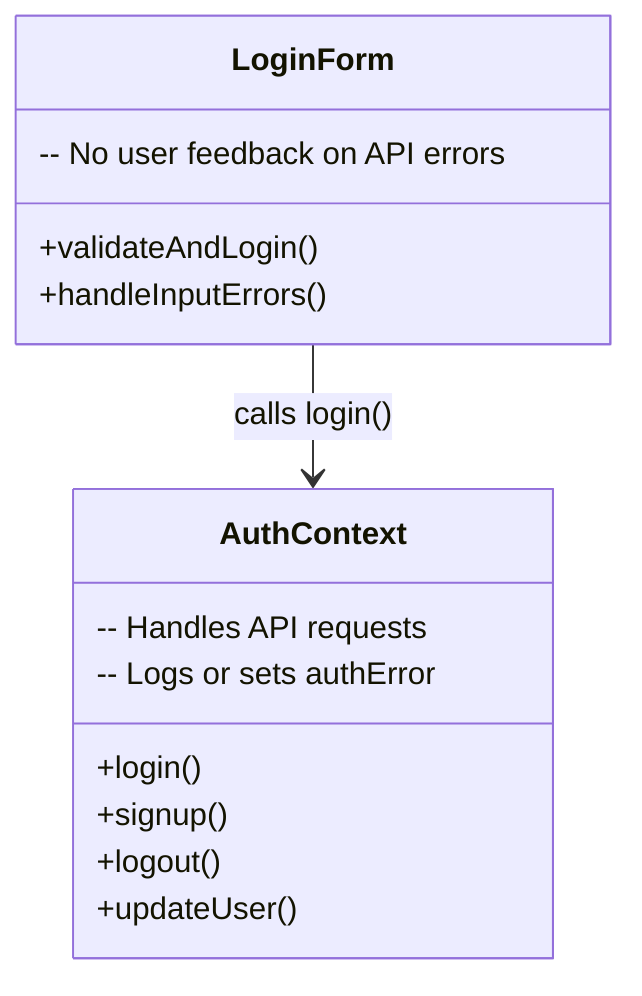
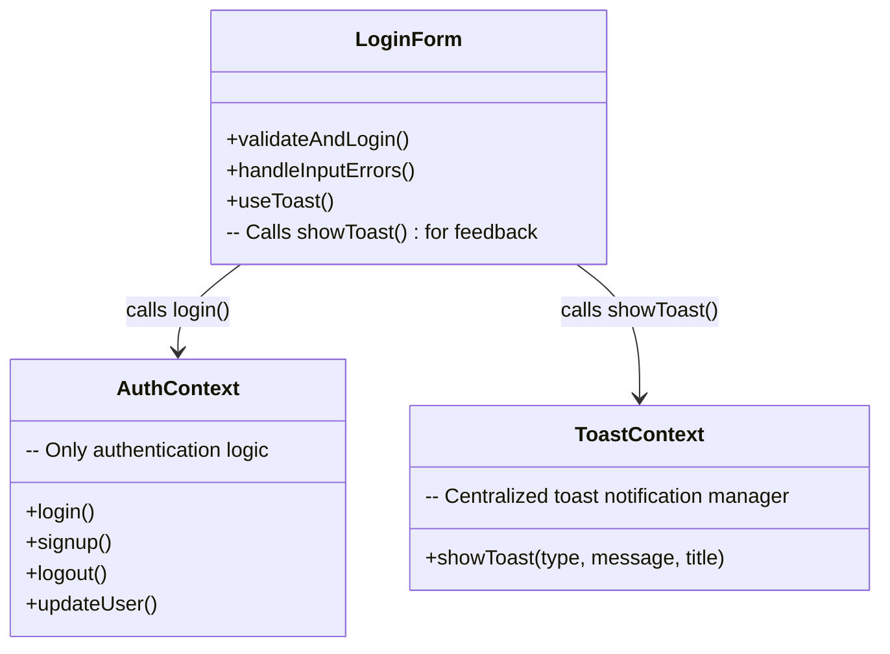

# Design Pattern – Trying to Apply a Design Pattern to a Non-Object-Oriented Language

Maybe you have already experienced this issue: many well-known design patterns fit nicely into an object-oriented language like Java.  
But what happens if there's a script sneaking behind your Java, and suddenly you're stuck with JavaScript?

Well, that's our situation right now, and we started a little odyssey: how can we apply these design patterns to our tech stack?

We landed on the design pattern called **"Mediator"**, which acts like a friendly police officer standing at a busy intersection, directing who can move next.  
Everyone has to communicate through this helpful officer.

---

## What Was the Current Situation?

We decided to try building our own little "police officer" to handle the API response messages from our backend.  
But first, let's take a quick peek at the current state of the code.  
We chose the always-loved and overused **login example**:

What you see here is our first approach to handling backend response messages when, for example, an error occurs.  
I mean, just look at it — beautiful copy-paste bugs like `"Sign up failed:"` appear, even though we're trying to **log in**, not sign up!  
There's even a nice comment `"If you're displaying it"`, as if we might not want to show the user that the login failed. 🙈

And unfortunately, it doesn't get any better in our actual login page.  
Take a look at how well we handled error messages there:

How do we say it in German?  
*"Wie Sie sehen, sehen Sie nichts!"* — that's right!  
Besides some basic input checks, we completely **vercheckt** (missed) adding any error feedback to the user.

---

## How Did We Apply the Mediator Design Pattern to This Mess?

One solution would be to simply show the error message as static text on the login form.  
But that would not be very elegant — and definitely not reusable for all the other API endpoints that are crying out for proper message handling!

At this point, our Mediator — or rather, the **Frankenstein monster of a Mediator** — entered the game.  
Our "Mediator" is a **Toast** — no, not the bread kind 🍞, but a small UI element that pops up and disappears after a short time.  
A perfect fit for showing short messages!

This screenshot shows the basic structure of our Toast system:  
We have different types of Toasts that change their appearance depending on the message type — so there's something for every taste!

Now if we put this in context — and I mean real context — we make the Toast system available to every component and page in our app without passing it through dozens of parent components.  
Honestly, **nobody likes toast that's been through a dozen hands**. 🥴

---

## How We Use the Toast Now

Our last step was to actually use the new, fresh Toast wherever we need to show backend messages, and ensure the error or success message is available at the right place.

Here's the updated `login.tsx`:

As you can see, we now simply call `showToast` with the appropriate type and message.  
The really tasty part about our **ToastContext** is that we can now use it **anytime** our user interacts with the backend —  
for example: *"Plant successfully created"* — **plop** — quick, friendly feedback to the user!

---

## Did We Actually Apply the Mediator Pattern?

Well... if you take a close look at the description of the [Mediator Pattern](https://refactoring.guru/design-patterns/mediator), you'll realize it's actually much more powerful than our use case.  
But we are very happy with our little **Mediator-Toast** solution!

We now use only **one single component** to handle all feedback messages for any API response from the backend.

We also updated our [Software Architecture Document (SAD)](https://github.com/DHBW-Malte/gardeningApp/blob/main/green-fingers/docs/SoftwareArchitectureDocument.md) and added a new chapter about this design pattern and the refactoring we did.

We also tried to create a “class diagram” before and after the refactoring to better visualize the restructuring.

### Before the Refactoring

### After the Refactoring

For the after diagram, we can now add further classes such as createPlant, updatePlant, deleteGarden ... which all use the showToast() function and will communicate directly with the toast.

---

Thanks for reading — and remember: **don't burn the toast!** Cheers 🥂!
