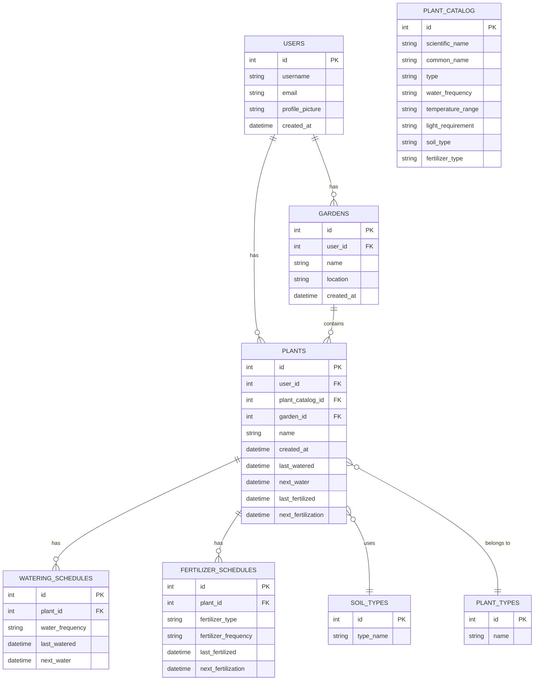

# Green Fingers - Software Architecture Document

## Table of Contents
- [1. Introduction](#1-introduction)
    - [1.1 Purpose](#11-purpose)
    - [1.2 Scope](#12-scope)
    - [1.3 Definitions, Acronyms, and Abbreviations](#13-definitions-acronyms-and-abbreviations)
    - [1.4 References](#14-references)
    - [1.5 Overview](#15-overview)
- [2. Architectural Representation](#2-architectural-representation)
    - [2.1 Model-View-ViewModel (MVVM)](#21-model-view-viewmodel-mvvm)
    - [2.2 MVVM High-Level Overview](#22-mvvm-high-level-overview)
- [3. Architectural Goals and Constraints](#3-architectural-goals-and-constraints)
- [4. Use-Case View](#4-use-case-view)
- [5. Logical View](#5-logical-view)
    - [5.1 High-Level Overview](#51-high-level-overview)
    - [5.2 Class Diagram](#52-class-diagram)
- [6. Process View](#6-process-view)
- [7. Deployment View](#7-deployment-view)
- [8. Implementation View](#8-implementation-view)
- [9. Data View](#9-data-view)
- [10. Size and Performance](#10-size-and-performance)
- [11. Quality](#11-quality)

## 1. Introduction
### 1.1 Purpose
The purpose of this document is to provide a comprehensive overview of the software architecture for the "Green Fingers" gardening application. It outlines the architectural representation, goals, constraints, and views of the system to guide through the development process.
### 1.2 Scope
This document describes the technical architecture of the "Green Fingers" application, including the logical, process, deployment, and implementation views. It aims to provide a detailed understanding of the system's structure and components to facilitate the development and maintenance of the application.
### 1.3 Definitions, Acronyms, and Abbreviations
TBD
### 1.4 References
TBD
### 1.5 Overview

## 2. Architectural Representation
### 2.1 Model-View-ViewModel (MVVM)
Because the "Green Fingers" appliactions is a mobile application, we have chosen the Model-View-ViewModel (MVVM) architectural pattern to structure the codebase. MVVM is a design pattern that separates the user interface logic from the business logic and data model. It consists of three main components:
- **Model**: Represents the data and business logic of the application. We choose Firebase with it realtime database Firestore as our backend to store the data, like data from the users, plants and gardens.

- **View**: Represents the user interface and visual elements of the application. The components of our React Native application are used to create the views, like e.g. user profile, plant details and garden overviews.

- **ViewModel**: Acts as an intermediary between the Model and the View, handling the data and business logic to be displayed in the View. React Native takes care of the ViewModel part by using the React hooks and context API.

### 2.2 MVVM High-Level Overview
The following diagrams are manual created, thats why they are not up to date. The diagrams are created with draw.io and exported as svg files. The diagrams are stored in the docs/assets/svg/architecturalDiagrams folder. The following diagram illustrates the high-level overview of the MVVM architectural pattern in the "Green Fingers" application:

## 3. Architectural Goals and Constraints
## 4. Use-Case View
This is a high-level overview of the use-case view of the "Green Fingers" application. It outlines the main use cases and actors involved in the system.

## 5. Logical View
### 5.1 High-Level Overview
As mentioned earlier, the "Green Fingers" application follows the MVVM architectural pattern. Therefore the logical view of the system is divided into three main components: Model, View, and ViewModel.

**Model**: For the model part of our application, we are using the Firebase services like Firestore to store data and Authentication for user management. The data is stored in collections and documents in Firestore, which can be accessed and manipulated by the application.

**View**: The view part of the application is built using React Native components. These components are used to create the user interface and visual elements of the application. The interface will present the data from the ViewModel to the user and allow them to interact with the application.

**ViewModel**: With React native we manage the data ans state of the application using React hooks and context API. The ViewModel is responsible for handling the data and business logic of the application. It acts as an intermediary between the Model and the View, providing the data to be displayed in the View.

### 5.2 Class Diagram

The following class diagram provides a high-level overview of the classes and their relationships in the "Green Fingers" application. The diagram includes the main classes such as User, Plant, Garden, and UserPlant.

## 6. Process View
TBD
## 7. Deployment View
## 8. Implementation View
TBD
## 9. Data View

## 10. Size and Performance
TBD
## 11. Quality
TBD

