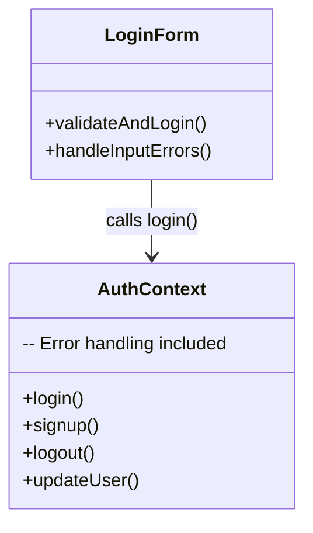
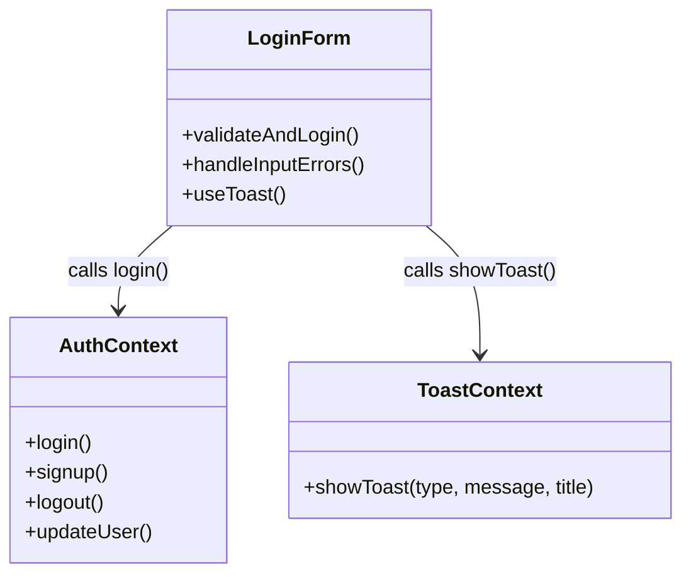
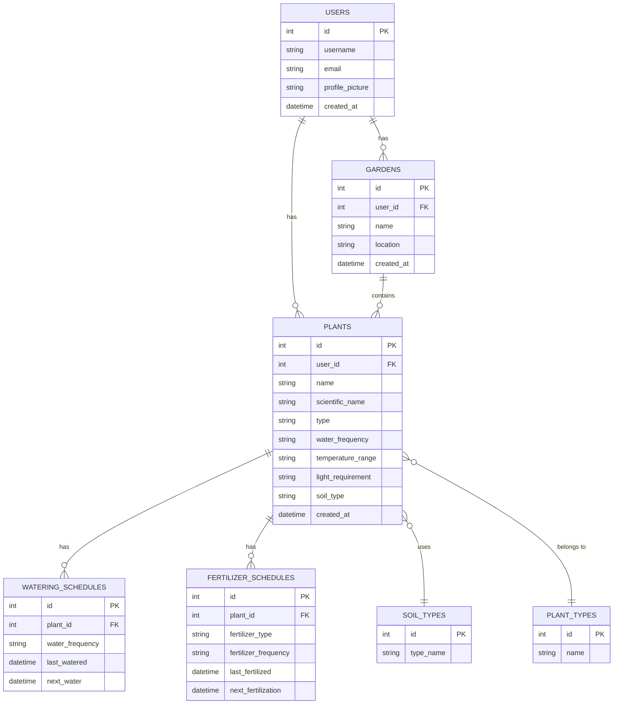

# Green Fingers - Software Architecture Document

## Table of Contents
- [1. Introduction](#1-introduction)
    - [1.1 Purpose](#11-purpose)
    - [1.2 Scope](#12-scope)
    - [1.3 Definitions, Acronyms, and Abbreviations](#13-definitions-acronyms-and-abbreviations)
    - [1.4 References](#14-references)
    - [1.5 Overview](#15-overview)
- [2. Architectural Representation](#2-architectural-representation)
    - [2.1 Model-View-ViewModel (MVVM)](#21-model-view-viewmodel-mvvm)
    - [2.2 MVVM High-Level Overview](#22-mvvm-high-level-overview)
- [3. Architectural Goals and Constraints](#3-architectural-goals-and-constraints)
- [4. Use-Case View](#4-use-case-view)
- [5. Logical View](#5-logical-view)
    - [5.1 High-Level Overview](#51-high-level-overview)
    - [5.2 Class Diagram](#52-class-diagram)
    - [5.3 Refactoring with Design Patterns](#53-refactoring-with-design-patterns)
- [6. Process View](#6-process-view)
- [7. Deployment View](#7-deployment-view)
- [8. Implementation View](#8-implementation-view)
- [9. Data View](#9-data-view)
- [10. Size and Performance](#10-size-and-performance)
- [11. Quality](#11-quality)

## 1. Introduction
### 1.1 Purpose
The purpose of this document is to provide a comprehensive overview of the software architecture for the "Green Fingers" gardening application. It outlines the architectural representation, goals, constraints, and views of the system to guide through the development process.

### 1.2 Scope
This document describes the technical architecture of the "Green Fingers" application, including the logical, process, deployment, and implementation views. It aims to provide a detailed understanding of the system's structure and components to facilitate the development and maintenance of the application.

### 1.3 Definitions, Acronyms, and Abbreviations
| Abbrevation | Description                            |
| ----------- | -------------------------------------- |
| API         | Application Programming Interface      |
| MVVM        | Model View ViewModel                   |
| SRS         | Software Requirements Specification    |
| UC          | Use Case                               |
| n/a         | not applicable                         |

### 1.4 References

| Title                                                              | Last Updated       | Publishing organization   |
| -------------------------------------------------------------------|:----------:| ------------------------- |
| [GreenFingers Blog](https://dhbw-malte.github.io/gardeningApp/)| 21.11.2024 |GreenFingers  |
| [GitHub Repository](https://github.com/DHBW-Malte/gardeningApp/tree/main)| 21.11.2024 |GreenFingers  |
| [Overall Use Case Diagram](https://github.com/DHBW-Malte/gardeningApp/blob/main/docs/assets/svg/GreenFingersUsecases.drawio.svg)| 21.11.2024 |GreenFingers  |
| [SRS](https://github.com/DHBW-Malte/gardeningApp/blob/main/green-fingers/docs/SoftwareRequirementsSpecification.md)| 21.11.2024 |GreenFingers  |
| [UC: Create Account](https://github.com/DHBW-Malte/gardeningApp/blob/main/docs/usecases/CRUD-User/createUser.md)| 21.11.2024 |GreenFingers  |
| [UC: Edit Account](https://github.com/DHBW-Malte/gardeningApp/blob/main/docs/usecases/CRUD-User/updateUser.md)| 21.11.2024 |GreenFingers  |
| [UC: Login/Logout](https://github.com/DHBW-Malte/gardeningApp/blob/main/docs/usecases/CRUD-User/loginLogoutUser.md)| 21.11.2024 |GreenFingers  |
| [UC: Create Gardens](https://github.com/DHBW-Malte/gardeningApp/blob/main/docs/usecases/CRUD-Garden/addGarden.md)| 21.11.2024 |GreenFingers  |
| [UC: Read Gardens](https://github.com/DHBW-Malte/gardeningApp/blob/main/docs/usecases/CRUD-Garden/showGardens.md)| 21.11.2024 |GreenFingers  |
| [UC: Update Gardens](https://github.com/DHBW-Malte/gardeningApp/blob/main/docs/usecases/CRUD-Garden/updateGarden.md)| 21.11.2024 |GreenFingers  |
| [UC: Delete Gardens](https://github.com/DHBW-Malte/gardeningApp/blob/main/docs/usecases/CRUD-Garden/deleteGarden.md)| 21.11.2024 |GreenFingers  |
| [UC: Create Plants](https://github.com/DHBW-Malte/gardeningApp/blob/main/docs/usecases/CRUD-Plant/addPlant.md)| 21.11.2024 |GreenFingers  |
| [UC: Read Plants](https://github.com/DHBW-Malte/gardeningApp/blob/main/docs/usecases/CRUD-Plant/viewPlant.md)| 21.11.2024 |GreenFingers  |
| [UC: Update Plants](https://github.com/DHBW-Malte/gardeningApp/blob/main/docs/usecases/CRUD-Plant/updatePlant.md)| 21.11.2024 |GreenFingers  |
| [UC: Delete Plants](https://github.com/DHBW-Malte/gardeningApp/blob/main/docs/usecases/CRUD-Plant/deletePlant.md)| 21.11.2024 |GreenFingers  |
| [UC: Search Plants Database](https://github.com/DHBW-Malte/gardeningApp/blob/main/docs/usecases/CatalogPlants/explorePlants.md)| 21.11.2024 |GreenFingers  |

### 1.5 Overview
This document contains the Architectural Representation, Goals and Constraints as well as the Logical, Deployment, Implementation and Data Views.

## 2. Architectural Representation
### 2.1 Model-View-ViewModel (MVVM)
Because the "Green Fingers" appliactions is a mobile application, we have chosen the Model-View-ViewModel (MVVM) architectural pattern to structure the codebase. MVVM is a design pattern that separates the user interface logic from the business logic and data model. It consists of three main components:
- **Model**: Represents the data and business logic of the application. We choose Firebase with it realtime database Firestore as our backend to store the data, like data from the users, plants and gardens.

- **View**: Represents the user interface and visual elements of the application. The components of our React Native application are used to create the views, like e.g. user profile, plant details and garden overviews.

- **ViewModel**: Acts as an intermediary between the Model and the View, handling the data and business logic to be displayed in the View. React Native takes care of the ViewModel part by using the React hooks and context API.

### 2.2 MVVM High-Level Overview
The following diagram illustrates the high-level overview of the MVVM architectural pattern in the "Green Fingers" application:

## 3. Architectural Goals and Constraints

## 4. Use-Case View
This is a high-level overview of the use-case view of the "Green Fingers" application. It outlines the main use cases and actors involved in the system.

## 5. Logical View
### 5.1 High-Level Overview
As mentioned earlier, the "Green Fingers" application follows the MVVM architectural pattern. Therefore the logical view of the system is divided into three main components: Model, View, and ViewModel.

**View**: The view part of the application is built using React Native components. These components are used to create the user interface and visual elements of the application. The interface will present the data from the ViewModel to the user and allow them to interact with the application.

**Model**: For the model part of our application, we are using the Firebase services like Firestore to store data and Authentication for user management. The data is stored in collections and documents in Firestore, which can be accessed and manipulated by the application.

**ViewModel**: With React native we manage the data ans state of the application using React hooks and context API. The ViewModel is responsible for handling the data and business logic of the application. It acts as an intermediary between the Model and the View, providing the data to be displayed in the View.

---

The following diagrams are manual created, thats why they are **not up to date**. The diagrams are created with draw.io and exported as svg files. The diagrams are stored in the docs/assets/svg/architecturalDiagrams folder.

---

### 5.2 Class Diagram

The following class diagram provides a high-level overview of the classes and their relationships in the "Green Fingers" application. The diagram includes the main classes such as User, CatalogPlant, Garden, and UserPlant.

### 5.3 Refactoring with Design Patterns

We refactored parts of our frontend by introducing the Mediator Pattern through a centralized ToastContext.

Previously, error and success messages were handled manually inside the `AuthContext` and components like `login.tsx`, leading to tight coupling and inconsistent feedback. After refactoring, we now manage all user feedback uniformly through the ToastContext, improving modularity and maintainability.

### 5.3.1 Refactoring Summary

| Before | After (Mediator Pattern) |
|:------|:--------------------------|
| Feedback handled manually inside components | Centralized ToastContext handles feedback |
| Tight coupling between authentication logic and UI | Loose coupling through Mediator |
| No consistent user feedback | Consistent and reusable toast system |

### 5.3.2 Implementation Details

- Created `ToastContext.tsx` for centralized feedback management.
- Created `toastConfig.tsx` for standardized toast styles.
- Updated `AuthContext.tsx` to only handle authentication logic.
- Updated `login.tsx` to use `showToast()` from ToastContext.

### 5.3.3 Diagrams

**Before Refactoring**

**After Refactoring**

## 6. Process View
n/a
## 7. Deployment View
The “Green Fingers” application is designed as a mobile-first platform using cloud services for backend functionalities. The deployment consists of the following key components:

#### Mobile Client:
- Platform: Built with React Native, supporting iOS and Android platforms. Currently we work only on a Android version.
- User Interface: Provides the user-facing functionalities, including managing gardens, plants, and user profiles.

#### Backend Services:
- Cloud Provider: Firebase serves as the backend infrastructure.
- Database: Firestore is used as a real-time database to store user data, plant catalogs, and garden and plant information.
- Authentication: Firebase Authentication manages user accounts securely.

#### Deployment Architecture:
- The mobile application interacts with Firebase APIs for data access and authentication.
- All critical data, including user profiles, garden details, and plant records, are stored and retrieved via Firestore

## 8. Implementation View
The “Green Fingers” application uses the MVVM design pattern to organize the codebase efficiently. Key implementation details include:

#### Programming Frameworks and Languages:
- **Frontend**: React Native, with extensive use of React Hooks and Context API for state management.
- **Backend**: Firebase’s serverless infrastructure, providing scalable real-time services.

#### Source Control and Development Workflow:
- **Repository**: Code is hosted on GitHub, with a structured folder hierarchy for models, views, and viewmodels.
- **Development Tools**: Developers utilize VS Code with various extension like draw.io to create diagrams.

#### Testing and Debugging:
Until now there now test implemented but for the next semester, we plan to make use of Jest for extensive End-to-end testing of our application.

## 9. Data View

## 10. Size and Performance
n/a
## 11. Quality
n/a

