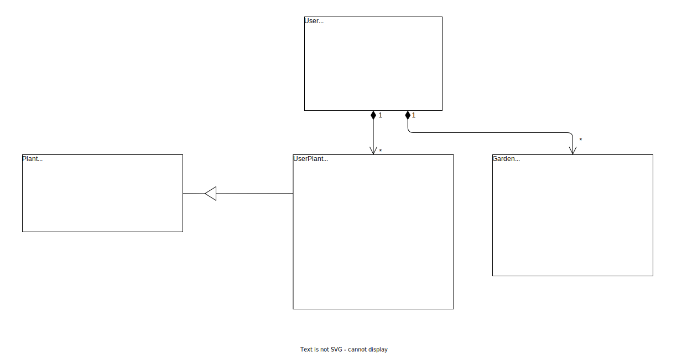
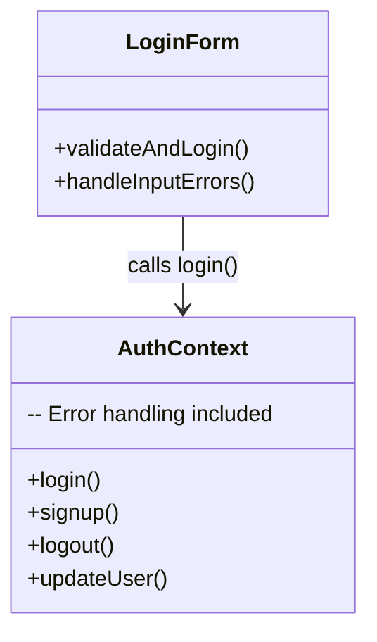
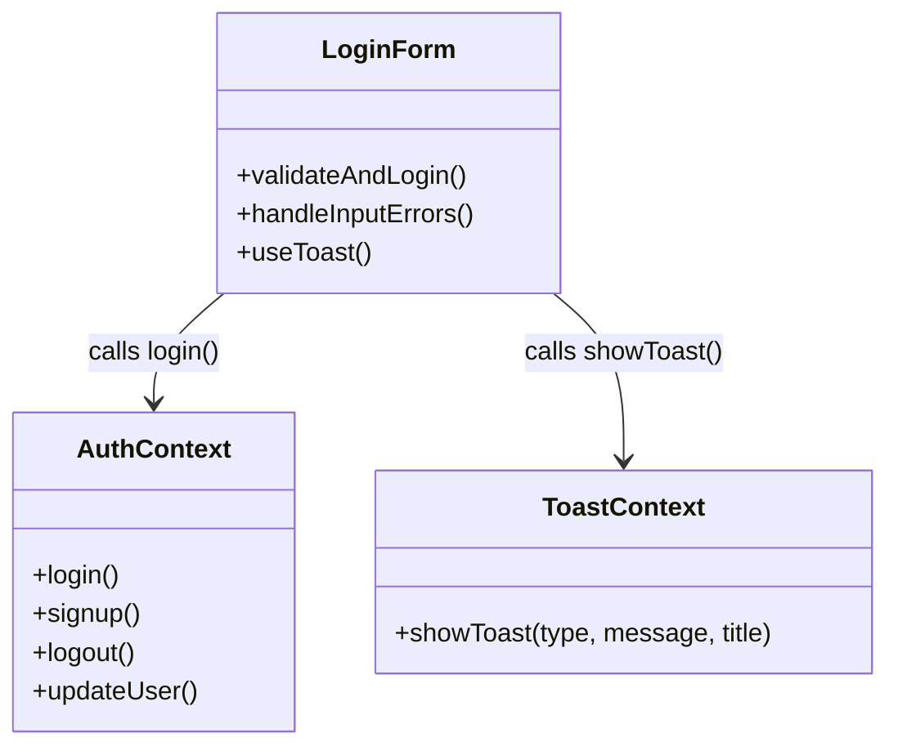
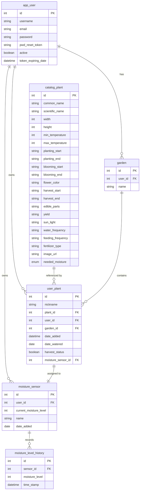

# Green Fingers - Software Architecture Document

## Table of Contents
- [1. Introduction](#1-introduction)
    - [1.1 Purpose](#11-purpose)
    - [1.2 Scope](#12-scope)
    - [1.3 Definitions, Acronyms, and Abbreviations](#13-definitions-acronyms-and-abbreviations)
    - [1.4 References](#14-references)
    - [1.5 Overview](#15-overview)
- [2. Architectural Representation](#2-architectural-representation)
    - [2.1 Model-View-Controller (MVC)](#21-model-view-controller-mvc)
    - [2.2 MVC High-Level Overview](#22-mvc-high-level-overview)
- [3. Architectural Goals and Constraints](#3-architectural-goals-and-constraints)
- [4. Use-Case View](#4-use-case-view)
- [5. Logical View](#5-logical-view)
    - [5.1 High-Level Overview](#51-high-level-overview)
    - [5.2 Class Diagram](#52-class-diagram)
    - [5.3 Refactoring with Design Patterns](#53-refactoring-with-design-patterns)
- [6. Process View](#6-process-view)
- [7. Deployment View](#7-deployment-view)
- [8. Implementation View](#8-implementation-view)
- [9. Data View](#9-data-view)
- [10. Size and Performance](#10-size-and-performance)
- [11. Quality](#11-quality)

## 1. Introduction
### 1.1 Purpose
The purpose of this document is to provide a comprehensive overview of the software architecture for the "Green Fingers" gardening application. It outlines the architectural representation, goals, constraints, and views of the system to guide through the development process.

### 1.2 Scope
This document describes the technical architecture of the "Green Fingers" application, including the logical, process, deployment, and implementation views. It aims to provide a detailed understanding of the system's structure and components to facilitate the development and maintenance of the application.

### 1.3 Definitions, Acronyms, and Abbreviations
| Abbrevation | Description                            |
| ----------- | -------------------------------------- |
| API         | Application Programming Interface      |
| MVC         | Model View Controller                  |
| SRS         | Software Requirements Specification    |
| UC          | Use Case                               |
| n/a         | not applicable                         |

### 1.4 References

| Title                                                              | Last Updated       | Publishing organization   |
| -------------------------------------------------------------------|:----------:| ------------------------- |
| [GreenFingers Blog](https://dhbw-malte.github.io/gardeningApp/)| 21.11.2024 |GreenFingers  |
| [GitHub Repository](https://github.com/DHBW-Malte/gardeningApp/tree/main)| 21.11.2024 |GreenFingers  |
| [Overall Use Case Diagram](https://github.com/DHBW-Malte/gardeningApp/blob/main/docs/assets/svg/GreenFingersUsecases.drawio.svg)| 21.11.2024 |GreenFingers  |
| [SRS](https://github.com/DHBW-Malte/gardeningApp/blob/main/green-fingers/docs/SoftwareRequirementsSpecification.md)| 21.11.2024 |GreenFingers  |
| [UC: Create Account](https://github.com/DHBW-Malte/gardeningApp/blob/main/docs/usecases/CRUD-User/createUser.md)| 21.11.2024 |GreenFingers  |
| [UC: Edit Account](https://github.com/DHBW-Malte/gardeningApp/blob/main/docs/usecases/CRUD-User/updateUser.md)| 21.11.2024 |GreenFingers  |
| [UC: Login/Logout](https://github.com/DHBW-Malte/gardeningApp/blob/main/docs/usecases/CRUD-User/loginLogoutUser.md)| 21.11.2024 |GreenFingers  |
| [UC: Create Gardens](https://github.com/DHBW-Malte/gardeningApp/blob/main/docs/usecases/CRUD-Garden/addGarden.md)| 21.11.2024 |GreenFingers  |
| [UC: Read Gardens](https://github.com/DHBW-Malte/gardeningApp/blob/main/docs/usecases/CRUD-Garden/showGardens.md)| 21.11.2024 |GreenFingers  |
| [UC: Update Gardens](https://github.com/DHBW-Malte/gardeningApp/blob/main/docs/usecases/CRUD-Garden/updateGarden.md)| 21.11.2024 |GreenFingers  |
| [UC: Delete Gardens](https://github.com/DHBW-Malte/gardeningApp/blob/main/docs/usecases/CRUD-Garden/deleteGarden.md)| 21.11.2024 |GreenFingers  |
| [UC: Create Plants](https://github.com/DHBW-Malte/gardeningApp/blob/main/docs/usecases/CRUD-Plant/addPlant.md)| 21.11.2024 |GreenFingers  |
| [UC: Read Plants](https://github.com/DHBW-Malte/gardeningApp/blob/main/docs/usecases/CRUD-Plant/viewPlant.md)| 21.11.2024 |GreenFingers  |
| [UC: Update Plants](https://github.com/DHBW-Malte/gardeningApp/blob/main/docs/usecases/CRUD-Plant/updatePlant.md)| 21.11.2024 |GreenFingers  |
| [UC: Delete Plants](https://github.com/DHBW-Malte/gardeningApp/blob/main/docs/usecases/CRUD-Plant/deletePlant.md)| 21.11.2024 |GreenFingers  |
| [UC: Search Plants Database](https://github.com/DHBW-Malte/gardeningApp/blob/main/docs/usecases/CatalogPlants/explorePlants.md)| 21.11.2024 |GreenFingers  |
| [UC: Create Sensor](https://github.com/Green-Fingers-App/gardeningApp/blob/main/docs/usecases/CRUD-Sensor/addSensor.md)| 01.06.2025 |GreenFingers  |
| [UC: Read Sensor](https://github.com/Green-Fingers-App/gardeningApp/blob/main/docs/usecases/CRUD-Sensor/showSensor.md)| 01.06.2025 |GreenFingers  |
| [UC: Update Sensor](https://github.com/Green-Fingers-App/gardeningApp/blob/main/docs/usecases/CRUD-Sensor/updateSensor.md)| 01.06.2025 |GreenFingers  |

### 1.5 Overview
This document contains the Architectural Representation, Goals and Constraints as well as the Logical, Deployment, Implementation and Data Views.

## 2. Architectural Representation
### 2.1 Model-View-Controller (MVC)
Since the "GreenFingers" application is a mobile app with a structured backend, we have decided to adopt the **Model-View-Controller (MVC)** architectural pattern for our implementation. MVC provides a clear separation of concerns and aligns well with our use of a Node.js/Express backend and a PostgreSQL database. It consists of the following components:
- **Model**: Handles the core data and business logic of the application. In our case, this includes the PostgreSQL database and the logic within the backend to manage users, gardens, plants, and sensor data.

- **View**: Represents the user interface. In our React Native frontend, Views are built using components such as garden overviews, plant detail pages, and sensor dashboards. These components directly present data fetched from the backend.

- **Controller**: Acts as the intermediary between the Model and the View. In our Express.js backend, controllers receive requests from the frontend, process them (e.g., validating input, updating the database), and return the necessary data or status back to the frontend.

### 2.2 MVC High-Level Overview
The following diagram illustrates the high-level overview of the MVC architecture in the "GreenFingers" application, showing the interaction between the frontend (View), backend controllers, and the database models:

## 3. Architectural Goals and Constraints

## 4. Use-Case View
This is a high-level overview of the use-case view of the "Green Fingers" application. It outlines the main use cases and actors involved in the system.

## 5. Logical View
### 5.1 High-Level Overview
As outlined in the architectural section, the "GreenFingers" application now follows the **Model-View-Controller (MVC)** pattern. Accordingly, the logical structure of the system is organized into three main components: **Model**, **View**, and **Controller**.

**View**: The View is implemented using **React Native** components and represents the user-facing part of the application. It displays data received from the backend (via controllers) and handles user interactions, such as button presses and form inputs. Examples include the garden overview, plant detail screen, and sensor data charts.

**Model**: The Model encapsulates the application's core data and logic, residing in the **PostgreSQL** database and the backend's business logic layer. It defines entities like users, gardens, plants, and moisture sensor data. The Express.js backend interacts with these models to store, retrieve, and process data.

**Controller**: Controllers are part of the **Node.js + Express.js** backend and serve as the bridge between View and Model. They receive HTTP requests from the frontend, validate and process input, call the appropriate model functions, and return JSON responses. Controllers ensure that business logic is decoupled from the UI.

---

The following diagrams are manual created, thats why they are **not up to date**. The diagrams are created with draw.io and exported as svg files. The diagrams are stored in the docs/assets/svg/architecturalDiagrams folder.

---

#### Logical View Diagram

### 5.2 Class Diagram

The following class diagram provides a high-level overview of the classes and their relationships in the "Green Fingers" application. The diagram includes the main classes such as User, CatalogPlant, Garden, UserPlant, Calendar and Sensor.

### 5.3 Refactoring with Design Patterns

We refactored parts of our frontend by introducing the Mediator Pattern through a centralized ToastContext.

Previously, error and success messages were handled manually inside the `AuthContext` and components like `login.tsx`, leading to tight coupling and inconsistent feedback. After refactoring, we now manage all user feedback uniformly through the ToastContext, improving modularity and maintainability.

### 5.3.1 Refactoring Summary

| Before | After (Mediator Pattern) |
|:------|:--------------------------|
| Feedback handled manually inside components | Centralized ToastContext handles feedback |
| Tight coupling between authentication logic and UI | Loose coupling through Mediator |
| No consistent user feedback | Consistent and reusable toast system |

### 5.3.2 Implementation Details

- Created `ToastContext.tsx` for centralized feedback management.
- Created `toastConfig.tsx` for standardized toast styles.
- Updated `AuthContext.tsx` to only handle authentication logic.
- Updated `login.tsx` to use `showToast()` from ToastContext.

### 5.3.3 Diagrams

**Before Refactoring**

**After Refactoring**

## 6. Process View
n/a
## 7. Deployment View
The “GreenFingers” application is designed as a mobile-first platform with a containerized backend infrastructure and CI/CD automation. The deployment architecture includes the following key components:

#### Mobile Client:
- **Platform**: Built with **React Native**, currently targeting **Android** only. The app is packaged using the **Gradle build system** and distributed as an APK.
- **User Interface**: The app provides all core user functionalities, including managing gardens, assigning plants, viewing sensor data, and updating user profiles.

#### Backend Services:
- **Platform**: The backend is developed with **Node.js** and **Express.js**, providing a RESTful API for the mobile app.
- **Deployment**: The backend and PostgreSQL database are deployed on a **self-hosted server** using **Docker Compose**, ensuring isolation and easy service management.
- **Database**: A **PostgreSQL** database stores structured data including users, gardens, plants, sensors, and moisture history.
- **Security & Auth**: User authentication is handled via **JSON Web Tokens (JWT)**, and sensitive actions are protected with middleware and token verification.

#### CI/CD and Automation:
GitHub Workflows:
- We use **GitHub Actions** for continuous integration and deployment:
  - **Backend**: On every push to the `main` branch, a workflow builds and redeploys the Dockerized backend and database using a self-hosted runner.
  - **Testing**: Both frontend and backend are automatically tested using `jest`, with code coverage metrics.
  - **Android Build**: A separate workflow builds the Android APK using `gradlew assembleRelease` and can attach it to a GitHub Release.

#### Deployment Architecture Overview:
- The **React Native app** communicates with the **Express.js backend** over HTTPS.
- The **backend** handles all data processing, validation, and database interaction.
- The **PostgreSQL** database persists all application data.
- The entire backend infrastructure is encapsulated in Docker containers for consistent deployment and ease of maintenance.

## 8. Implementation View
The “GreenFingers” application follows the **Model-View-Controller (MVC)** pattern to maintain a clear and maintainable codebase. Below are key implementation aspects of the system:

#### Programming Frameworks and Languages:
- **Frontend**:
  - Built with **React Native** (using Expo and Gradle for Android builds).
  - State management is handled using **React Hooks** and the **Context API**.
  - Key features include QR-based sensor provisioning, moisture charts, and live WebSocket updates.

- **Backend**:
  - Developed in **Node.js** using the **Express.js** framework.
  - **PostgreSQL** is used as the relational database to store user, garden, plant, and sensor data.
  - **Docker Compose** is used to deploy both the backend server and the database in isolated containers.

#### Source Control and Development Workflow:
- **Version Control**: All source code is hosted in a **GitHub repository**, using a clean folder structure separating frontend, backend, and shared assets.

- **Development Tools**:
  - **VS Code** and **NeoVim** is the primary IDE used by the team.
  - **draw.io** is used to design and maintain architecture and workflow diagrams.
  - **Postman** is used for testing API endpoints during development.

- **Build Process**:
  - The Android version is built using **Gradle** via the `assembleRelease` task.
  - Backend services are packaged and deployed via **Docker**.

#### Testing and Debugging:
- **Unit & Integration Testing**:
  - We have implemented **Jest** tests for both the **React Native frontend** and the **Node.js backend**.
  - Test coverage includes core service functions, authentication, API routes, and UI components.

- **End-to-End Testing**:
  - **Maestro** is used to automate E2E flows (e.g., login, plant and garden creation).
  - E2E test scripts ensure critical app flows work as expected on Android devices.

- **Continuous Integration**:
  - GitHub Actions run automated tests on every push, ensuring code quality and preventing regressions.

## 9. Data View

## 10. Size and Performance
n/a
## 11. Quality
n/a

