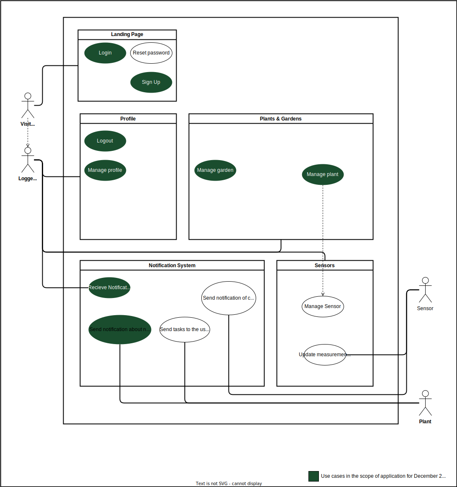

# Green Fingers - Software Requirements Specification 

## Table of contents
- [Table of contents](#table-of-contents)
- [Introduction](#1-introduction)
    - [Purpose](#11-purpose)
    - [Scope](#12-scope)
    - [Definitions, Acronyms, and Abbreviations](#13-definitions-acronyms-and-abbreviations)
    - [References](#14-references)
    - [Overview](#15-overview)
- [Overall Description](#2-overall-description)
    - [Vision](#21-vision)
    - [Use Case Diagram](#22-use-case-diagram)
    - [used Tools](#23-Used-Tools)
- [Specific Requirements](#3-specific-requirements)
    - [Functionality](#31-functionality)
    - [Usability](#32-usability)
    - [Reliability](#33-reliability)
    - [Performance](#34-performance)
    - [Supportability](#35-supportability)
    - [Design Constraints](#36-design-constraints)
    - [Online User Documentation and Help System Requirements](#37-on-line-user-documentation-and-help-system-requirements)
    - [Purchased Components](#purchased-components)
    - [Interfaces](#39-interfaces)
    - [Licensing Requirements](#310-licensing-requirements)
    - [Legal, Copyright And Other Notices](#311-legal-copyright-and-other-notices)
    - [Applicable Standards](#312-applicable-standards)
- [Supporting Information](#4-supporting-information)

## 1. Introduction

### 1.1 Purpose
This Software Requirements Specification (SRS) provides a comprehensive description of the specifications for the "Green Fingers" application. It aims to assist gardeners in tracking plant care through features like adding plants, managing watering schedules, receiving notifications, and integrating sensor data. This document details the planned features, functionality, and boundary conditions for the development of the app.

### 1.2 Scope
The app will be developed for both Android and iOS (via Flutter).
  
Actors of this app include:
- Users: Gardeners who will use the app to track their plants and care schedules.
- Admins: Admins responsible for maintaining plant databases and overseeing app content.
  
The main subsystems include:
* Plant Database:  
Store and manage detailed information about plants (e.g., watering frequency, temperature, sunlight requirements).
* User Account System:
Users will create accounts to store gardens and plant data.
* Notifications System:  
Notify users when they need to water or take care of their plants.
* Search System:
Allow users to search for plants based on various parameters like water needs, sunlight, or season.

### 1.3 Definitions, Acronyms and Abbreviations
| Abbrevation | Explanation                            |
| ----------- | -------------------------------------- |
| SRS         | Software Requirements Specification    |
| UC          | Use Case                               |
| n/a         | not applicable                         |
| tbd         | to be determined                       |
| UCD         | overall Use Case Diagram               |
| FAQ         | Frequently asked Questions             |

### 1.4 References

| Title                                                              | Date       | Publishing organization   |
| -------------------------------------------------------------------|:----------:| ------------------------- |
| [Green Fingers Blog](https://dhbw-malte.github.io/gardeningApp/)   | 20.11.2024 | Green Fingers Team        |
| [GitHub](https://github.com/DHBW-Malte/gardeningApp/)              | 20.11.2024 | Green Fingers Team        |
| [YouTrack](https://dhbw-malte.youtrack.cloud/)                     | 20.11.2024 | Green Fingers Team        |

### 1.5 Overview
The following chapter provides an overview of this project, including a vision and Overall Use Case Diagram. The third chapter (Requirements Specification) delivers more details about the specific requirements in terms of functionality, usability, and design parameters. Finally, there is a chapter with supporting information. 
    
## 2. Overall Description

### 2.1 Vision

Our vision is to provide a comprehensive gardening solution that seamlessly integrates software and hardware tools to empower users in managing both indoor and outdoor gardens. With a focus on automation and smart features, we offer real-time weather updates, UV lighting sensors, moisture tracking, and a solar-powered watering system, ensuring optimal plant care.

We aim to guide users with tailored advice on watering, nutrition, sunlight, and harvest timing, along with insights into edible plant parts. Personalized notifications keep users informed of their plants’ needs, enhancing their gardening experience.

By offering efficient garden management tools—including pumps, tubing, and nozzles—and software that suggests plants based on location, provides plant calendars, and sends notifications, our goal is to simplify and streamline gardening. We empower users to feel confident and in command of their gardens, making the process smarter, more efficient, and more enjoyable through real-time insights and automation.

Check out our blog and read our first blog post to get to know more about our vison and our team roles.
[Our Vision](https://dhbw-malte.github.io/gardeningApp/2024/09/13/our-vision.html)

### 2.2 Use Case Diagram

### 2.3 used Tools

*Technology Stack: 
The technology we are planning to use is:

 Frontend:
- React Native
- Expo
- TypeScript

Database:
- Firebase (NoSQL)

IDE:
- Visual Studio 

Project Management:
- Youtrack
- GitHub
- Discord

Deployment:
- TBD

Testing:
- TBD

## 3. Specific Requirements

### 3.1 Functionality
This section will explain the different use cases, you could see in the Use Case Diagram, and their functionality.  
#### 3.1.1 Sign Up

Users will be able to create a new account using an email address and password, or by signing up through third-party authentication providers (e.g., Google, Facebook).

#### 3.1.2 Login / Logout

Users will log into their accounts using an email and password or third-party credentials. They can also log out when needed.

#### 3.1.3 Add plant 

Users can add new plants to their personal garden by entering plant details such as name, watering frequency, sunlight requirements, and more.
### [Usecase: add plant](docs/usecases/CRUD-Plant/addPlant.md)
This usecase is part of the **CURD-usecases** of the plant objects.

#### 3.1.4 Delete plant

The user can delete a plant from their app. This will remove the plant from the user's garden and all associated data in the database.
### [Usecase: delete plant](docs/usecases/CRUD-Plant/deletePlant.md)
This usecase is part of the **CURD-usecases** of the plant objects.

#### 3.1.5 View plant

The user can search and view a plant from our data base.
### [Usecase: view plant](docs/usecases/CRUD-Plant/viewPlant.md)
This usecase is part of the **CURD-usecases** of the plant objects.

#### 3.1.6 Add Garden

The user can add diffrent gardens.
### [Usecase: add garden](docs/usecases/CRUD-Garden/addGarden.md)
This usecase is part of the **CURD-usecases** of the plant objects.

#### 3.1.7 Delete Garden

The user can delete a garden from their app. This will remove the plant from the user's garden and all associated data in the database.
### [Usecase: delete garden](docs/usecases/CRUD-Garden/deleteGarden.md)
This usecase is part of the **CURD-usecases** of the plant objects.

#### 3.1.8 show garden

Our first activity diagram showcases the flow of events for the “Show Gardens” use case. This use case allows users to view an overview of all gardens they have created. By navigating to the garden overview, users can see a list of all their gardens, each with essential information such as the garden name, image, and status.
### [Usecase: show garden](docs/usecases/CRUD-Garden/showGardens.md)
This usecase is part of the **CURD-usecases** of the plant objects.

#### 3.1.9 Recieve Notification
The user can receive notifications about their plants' health status or needs. These notifications will be sent based on the plant's requirements and the user's settings.

#### 3.1.10 Send notification about plant needs
Each plant can send notifications to the user about its needs and health status. These notifications will be triggered based on the plant's data and the user's preferences.

### 3.2 Usability
We plan to design the user interface as intuitive and self-explanatory as possible, so users will feel comfortable organizing their plants as they wish.

#### 3.2.1 No training time needed
The app's user interface will be intuitive and require no formal training. Users should be able to navigate and use its features effortlessly upon first interaction. This will be achieved by incorporating simple navigation menus, clear labels, and recognizable icons.

#### 3.2.2 Familiar Feeling
The design will incorporate elements familiar to users from other applications, such as plus sign as an add button, pull-to-refresh actions, and standard app layouts. Leveraging common UI/UX patterns ensures that users feel at home while exploring the app, reducing the cognitive load associated with learning a new tool.

#### 3.2.3 Customization
Users can customize their dashboard and notifications to suit their preferences. This includes selecting what information is displayed prominently and scheduling reminders at times most convenient for them.

#### 3.2.4 Security and Privacy
We use Firebase Authentication to handle user logins securely. This supports email/password login options to ensure that users can only access their own data. This includes role-based access controls for admins and users.

### 3.3 Reliability

#### 3.3.1 Availability
The app will ensure 99.9% uptime, supported by Firebase's reliable hosting and backend services. Regular monitoring and fallback mechanisms will be in place to mitigate downtime and service interruptions.

#### 3.3.2 Backup and Recovery
Automatic backups will be implemented for user data on Firebase. In case of data loss, recovery mechanisms will ensure data restoration with minimal impact.

### 3.4 Perfomance

#### 3.4.1 Capacity
The app will support up to 100 concurrent users as per Firebase's free tier limits. If the app scales beyond this, upgrading to a paid Firebase plan or implementing additional backend solutions will be considered.
#### 3.4.2 Storage 
Data storage is handled by Firebase, which efficiently manages both plant and user data using a NoSQL structure. Firebase's free tier offers up to 50,000 document reads and 50,000 writes per day and 1 GB of storage for the Firestore database. These limits will guide the initial implementation. If the app's user base grows significantly, storage and usage will be monitored, and a transition to a higher-tier plan will be considered to accommodate increased demand.

#### 3.4.3 App perfomance / Response time
The app is designed to achieve a response time of under 2 seconds for all user actions. During the loading time all the user's data from Firebase gets ready to use, this ensures low latency and high performance.

### 3.5 Supportability

#### 3.5.1 Coding Standards
The project will follow clean coding principles.

#### 3.5.2 Testing Strategy
in the future testing will include:
Unit tests for individual components and functions.
Integration tests to ensure seamless interaction between features.
End-to-end tests for real-world usage scenarios.
User acceptance testing (UAT) to ensure the app meets user expectations.
### 3.6 Design Constraints
- Mobile-First Design: The app is designed for mobile devices with React Native, ensuring responsiveness across various screen sizes.
- Platform Compatibility: The app will run on Android and in the future on iOS platforms.
- Hardware Integration: Compatibility with IoT devices for automated watering and sensor data is a core constraint.

### 3.7 On-line User Documentation and Help System Requirements
- Online Documentation: Comprehensive documentation will be available on the Green Fingers website, including step-by-step usage instructions and video guides.
- Support System: Users can contact support through in-app messaging or email for additional assistance.

### 3.8 Purchased Components
The following third-party components and services will be used:

- Firebase Authentication and Firestore Database: For secure data management.
- Expo Modules: for push notifications, camera access, and hardware integration.
- Third-Party Analytics Tool: TBD, to track app usage and performance.

### 3.9 Interfaces

#### 3.9.1 User Interfaces
## Screencast of Demo
The app will feature:
<video width="100%" height="auto" controls>

  <source src="/gardeningApp/assets/screencasts/MY Movie.mp4" type="video/mp4">
  Your browser doesn't support video tags
</video>

#### 3.9.2 Hardware Interfaces
Integration with IoT devices like soil moisture sensors and automated watering systems via APIs or Bluetooth.

#### 3.9.3 Software Interfaces
- Firebase for backend services.
- External APIs for weather data integration.
- Compatibility with mobile OS notification services

#### 3.9.4 Communication Interfaces
HTTPS protocol for all communication between the app and Firebase.
Bluetooth or Wi-Fi for IoT device integration.

### 3.10 Licensing Requirements

### 3.11 Legal, Copyright, and Other Notices
n/a

### 3.12 Applicable Standards
n/a

## 4. Supporting Information
For any further information you can contact the Green Fingers Team or check our [Green Fingers Blog](https://dhbw-malte.github.io/gardeningApp/). 
The Team Members are:
- Sima
- Casimir
- Ruan 
- Malte

<!-- Picture-Link definitions: -->
<!-- [OUCD]: https://github.com/IB-KA/CommonPlayground/blob/master/UseCaseDiagramCP.png "Overall Use Case Diagram" -->

